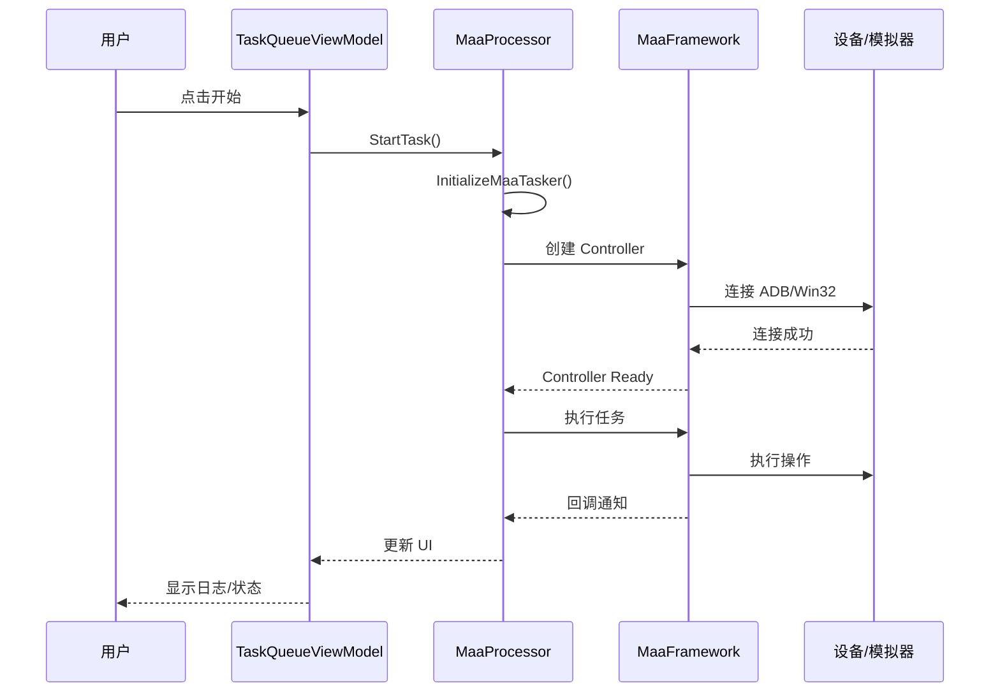

# 系统架构

本文档描述 MFAAvalonia 的整体架构设计。

## 架构概览

MFAAvalonia 采用 **MVVM（Model-View-ViewModel）** 架构模式，结合 MaaFramework 实现自动化任务执行。

```text
┌─────────────────────────────────────────────────────────────────┐
│                         表示层 (Views)                          │
│  ┌──────────┐  ┌──────────┐  ┌──────────┐  ┌──────────────────┐ │
│  │ 主窗口   │  │ 任务队列 │  │ 设置页面 │  │ 其他页面/对话框  │ │
│  └──────────┘  └──────────┘  └──────────┘  └──────────────────┘ │
│         ↑ DataBinding ↑           ↑              ↑              │
├─────────────────────────────────────────────────────────────────┤
│                     视图模型层 (ViewModels)                       │
│  ┌────────────────┐  ┌──────────────────┐  ┌─────────────────┐  │
│  │ RootViewModel  │  │TaskQueueViewModel│  │SettingsViewModel│  │
│  └────────────────┘  └──────────────────┘  └─────────────────┘  │
│              ↓                    ↓                ↓             │
├─────────────────────────────────────────────────────────────────┤
│                       业务逻辑层 (Services)                       │
│  ┌──────────────┐  ┌───────────────┐  ┌────────────────────┐    │
│  │ MaaProcessor │  │VersionChecker │  │ ConfigurationMgr  │    │
│  └──────────────┘  └───────────────┘  └────────────────────┘    │
│         ↓                                                        │
├─────────────────────────────────────────────────────────────────┤
│                      外部集成层 (External)                        │
│  ┌───────────────────────────────┐  ┌──────────────────────┐    │
│  │     MaaFramework.Binding      │  │   系统 API (ADB等)   │    │
│  └───────────────────────────────┘  └──────────────────────┘    │
└─────────────────────────────────────────────────────────────────┘
```

---

## MVVM 实现

### 技术选型

- **CommunityToolkit.Mvvm**: 提供 `ObservableObject`、`RelayCommand`、源生成器
- **Avalonia 编译绑定**: `AvaloniaUseCompiledBindingsByDefault=true`

### ViewModel 基类

```csharp
// ViewModels/ViewModelBase.cs
public class ViewModelBase : ObservableObject
{
    // 所有 ViewModel 继承此基类
}
```

### 数据绑定示例

```xml
<!-- View (AXAML) -->
<TextBlock Text="{Binding StatusText}" />
<Button Command="{Binding StartCommand}" />
```

```csharp
// ViewModel
public partial class ExampleViewModel : ViewModelBase
{
    [ObservableProperty]
    private string _statusText = "";
    
    [RelayCommand]
    private void Start() { /* ... */ }
}
```

---

## 核心组件

### MaaProcessor（任务处理器）

位于 `Extensions/MaaFW/MaaProcessor.cs`，是 MaaFramework 的核心封装。

**职责：**

- 初始化 MaaTasker 实例
- 加载 interface.json 配置
- 管理 ADB/Win32 控制器
- 执行任务队列
- 处理回调通知

**核心方法：**

```csharp
// 初始化 MAA 任务器
public async Task<bool> InitializeMaaTasker()

// 执行任务
public async Task<MaaStatus> StartTask(DragItemViewModel task)

// 处理回调
private void HandleCallBack(NotificationBase notification)
```

### MaaInterface（接口模型）

位于 `Extensions/MaaFW/MaaInterface.cs`，解析 interface.json 文件。

**主要类型：**

```csharp
public class MaaInterface
{
    public string Name { get; set; }
    public string Version { get; set; }
    public List<MaaInterfaceTask> Task { get; set; }
    public List<MaaInterfaceResource> Resource { get; set; }
    public Dictionary<string, MaaInterfaceOption> Option { get; set; }
}
```

### TaskQueueViewModel（任务队列）

位于 `ViewModels/Pages/TaskQueueViewModel.cs`，管理任务列表和執行狀態。

**主要功能：**

- 设备检测与连接
- 任务列表管理
- 日志输出
- 运行状态控制

---

## 服务管理

### Instances（服务定位器）

`Helper/Instances.cs` 提供全局服务访问。

```csharp
// 获取服务实例
var taskQueue = Instances.Resolve<TaskQueueViewModel>();

// 应用生命周期
Instances.ShutdownApplication();
Instances.RestartApplication();
```

### 配置管理

```csharp
// 读取配置
var value = ConfigurationManager.Current.GetValue<string>("key", "default");

// 保存配置
ConfigurationManager.Current.SetValue("key", value);
```

---

## 数据流

### 任务执行流程



### 配置加载流程

```text
应用启动
    ↓
Program.Main()
    ↓
App.OnFrameworkInitializationCompleted()
    ↓
ConfigurationManager.Initialize()
    ↓
MaaProcessor.ReadInterface()  ← 加载 interface.json
    ↓
TaskLoader.LoadTask()         ← 加载任务定义
    ↓
UI 就绪
```

---

## 多平台支持

### 平台抽象

| 功能 | Windows | Linux | macOS |
|------|---------|-------|-------|
| ADB 连接 | ✅ | ✅ | ✅ |
| Win32 窗口 | ✅ | ❌ | ❌ |
| 热键 | SharpHook | SharpHook | SharpHook |
| 托盘图标 | ✅ | ✅ | ✅ |

### 条件编译

```csharp
#if WINDOWS
    // Windows 专用代码
#elif LINUX
    // Linux 专用代码
#elif MACOS
    // macOS 专用代码
#endif
```

---

## 扩展机制

### 自定义识别器/动作

在 `Extensions/MaaFW/Custom/` 目录下实现：

```csharp
public class MyRecognizer : MaaCustomRecognizer
{
    public override RecoResult Recognize(MaaContext ctx, ...) { }
}
```

注册：

```csharp
tasker.Register(new MyRecognizer());
```
