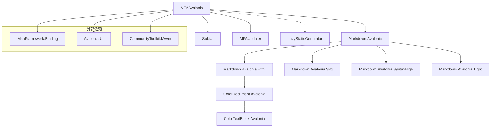

# 项目结构

本文档详细说明 MFAAvalonia 解决方案的项目结构和目录组织。

## 解决方案概览

MFAAvalonia.sln 包含 **11 个项目**，分为以下几类：

```
MFAAvalonia.sln
├── 主应用程序
│   └── MFAAvalonia              # 核心 GUI 应用
├── 工具程序
│   ├── MFAUpdater               # 自动更新器
│   └── LazyStaticGenerator      # 源代码生成器
├── UI 组件库
│   └── SukiUI                   # Avalonia UI 组件库
└── 渲染与文档库
    ├── Markdown.Avalonia        # Markdown 渲染基础库
    ├── Markdown.Avalonia.Html   # HTML 渲染扩展
    ├── Markdown.Avalonia.Svg    # SVG 渲染扩展
    ├── Markdown.Avalonia.Tight  # 紧凑版核心
    ├── Markdown.Avalonia.SyntaxHigh  # 语法高亮
    ├── ColorDocument.Avalonia   # 彩色文档组件
    └── ColorTextBlock.Avalonia  # 彩色文本控件
```

## 各项目详解

### MFAAvalonia（主应用）

核心 GUI 应用程序，集成 MaaFramework 实现自动化任务管理。

```
MFAAvalonia/
├── Program.cs                 # 应用入口，Mutex 处理，原生库加载
├── App.axaml(.cs)            # Avalonia 应用定义，生命周期管理
├── ViewLocator.cs            # ViewModel → View 自动定位器
├── PrivatePathHelper.cs      # 原生库路径解析
│
├── Configuration/            # 配置管理模块
│   ├── ConfigurationKeys.cs      # 配置键常量定义
│   ├── ConfigurationManager.cs   # 配置管理器
│   ├── GlobalConfiguration.cs    # 全局配置
│   └── MFAConfiguration.cs       # MFA 配置模型
│
├── ViewModels/               # 视图模型（MVVM）
│   ├── ViewModelBase.cs          # 基类
│   ├── Pages/                    # 页面 ViewModel
│   │   ├── TaskQueueViewModel.cs     # 任务队列（核心）
│   │   ├── SettingsViewModel.cs      # 设置页面
│   │   ├── ScreenshotViewModel.cs    # 截图页面
│   │   └── ResourcesViewModel.cs     # 资源页面
│   ├── Windows/                  # 窗口 ViewModel
│   │   ├── RootViewModel.cs          # 主窗口
│   │   ├── AnnouncementViewModel.cs  # 公告窗口
│   │   └── ChangelogViewModel.cs     # 更新日志
│   └── UsersControls/            # 用户控件 ViewModel
│       └── Settings/                 # 设置相关控件
│
├── Views/                    # 视图（XAML + CodeBehind）
│   ├── Pages/                    # 页面视图
│   ├── Windows/                  # 窗口视图
│   └── UserControls/             # 用户控件
│
├── Extensions/               # 扩展与集成
│   ├── MaaFW/                    # MaaFramework 集成
│   │   ├── MaaProcessor.cs           # MAA 处理器（核心引擎）
│   │   ├── MaaInterface.cs           # interface.json 模型
│   │   ├── MaaNode.cs                # 任务节点
│   │   ├── TaskLoader.cs             # 任务加载器
│   │   ├── FocusHandler.cs           # 焦点处理
│   │   ├── PathFinder.cs             # 路径查找
│   │   ├── ProcessHelper.cs          # 进程辅助
│   │   └── Custom/                   # 自定义识别器/动作
│   └── *.cs                      # 其他扩展（拖放、绑定等）
│
├── Helper/                   # 辅助工具类
│   ├── Instances.cs              # 服务实例管理
│   ├── VersionChecker.cs         # 版本检查
│   ├── LanguageHelper.cs         # 多语言支持
│   ├── LoggerHelper.cs           # 日志辅助
│   ├── EmulatorHelper.cs         # 模拟器检测
│   ├── ToastHelper.cs            # 消息通知
│   ├── TrayIconManager.cs        # 托盘图标
│   ├── GlobalHotkeyService.cs    # 全局热键
│   └── Converters/               # 值转换器
│
├── Utilities/                # 通用工具
│   └── Attributes/               # 自定义特性
│
└── Assets/                   # 资源文件
    ├── logo.ico                  # 应用图标
    └── Localization/             # 国际化资源
```

### MFAUpdater

独立的自动更新程序，用于下载和应用更新。

### LazyStaticGenerator

Roslyn 源代码生成器，用于生成懒加载静态属性代码，减少启动时间。

### SukiUI

定制版 [SukiUI](https://github.com/kikipoulet/SukiUI) 组件库，提供：

- 主题系统（亮色/暗色）
- 现代化控件
- 对话框系统
- Toast 通知
- 动画效果

### Markdown.Avalonia 系列

Markdown 渲染组件集：

- **Markdown.Avalonia**: 基础渲染引擎
- **Html**: HTML 标签支持
- **Svg**: SVG 图片支持
- **SyntaxHigh**: 代码语法高亮
- **Tight**: 紧凑核心实现

### ColorDocument/ColorTextBlock.Avalonia

富文本渲染组件，支持自定义颜色标记。

---

## 核心文件说明

| 文件 | 作用 |
|------|------|
| `Program.cs` | 应用入口，处理单实例 Mutex、命令行参数、原生库加载 |
| `App.axaml.cs` | Avalonia 应用初始化，依赖注入，全局异常处理 |
| `Instances.cs` | 服务解析器，管理全局单例 |
| `MaaProcessor.cs` | MAA 核心处理器，任务执行引擎，回调处理 |
| `MaaInterface.cs` | interface.json 数据模型，任务/资源/选项定义 |
| `TaskQueueViewModel.cs` | 任务队列核心逻辑，设备检测，日志输出 |
| `MFAConfiguration.cs` | 用户配置读写，加密存储 |

---

## 依赖关系


